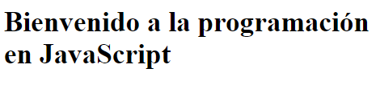
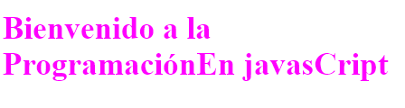
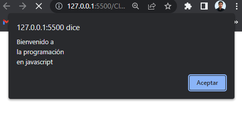

# Curso de javascript
## Clase 1: Mostrar una linea de texto en js
```html
<html>
    <meta charset="utf-8">
    <title>El primer Programa en javascript</title>
    <script type="text/javascript">
        document.writeln("<h1>Bienvenido a la programación en JavaScript</h1>");
    </script>
</html>
```
 

## Clase 2: Mostrar una linea de texto coloreado
```html
<html lang="en">
<head>
    <meta charset="UTF-8">
    <title>Imprimir una linea con varias instrucciones</title>
    <script>
        document.write("<h1 style ='color:magenta'>" );
        document.write("Bienvenido a la Programación" + "En javasCript</h1>");
    </script>
</head>

</html>
```
 

## Clase 3: Mostrar una texto en un dialogo de alerta
```html
<!DOCTYPE html>
<html lang="en">
<head>
    <meta charset="UTF-8">
    <title>Imprimir varias lineas en un cuadro de dialogo</title>
    <script>
        window.alert("Bienvenido a\nla programación \nen javascript");
    </script>
</head>
    <body>
        <p>Recargue la página para ejecutar de nuevo la alerta</p>
    </body>
</html>
```
 